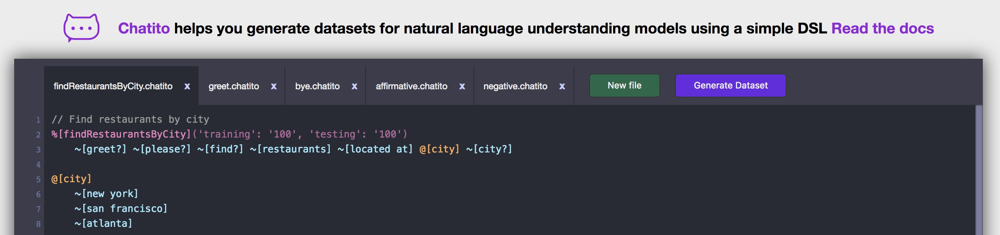

# New Training Model

Training data is needed so that Rasa can identify the intention of a text. Training data can be created in the form of Markdown or JSON. You can define this data in a single file or in multiple files in a directory. 

To create a trained model for Rasa from the Markdown or JSON, Rasa offers a REST API. An alternative to creating trained models is to install Rasa on your local machine and then create the model using the command "Rasa train nlu". Rasa creates the training model (tar.gz) from the Markdown or JSON.

> For further development, it is important that the existing training data be expanded and improved.

### Contents

- [Overview](#Overview)
	- [Training Input Data](#Training-Input-Data)
	- [Training Dataset](#Training-Dataset)
	- [Training Model](#Training-Model)
- [Step-by-Step Guide](#Step-by-Step-Guide)
- [Tracy](#Tracy)
- [Chatito](#Chatito)


## Overview

#### Training Input Data

Trining input data files are `.chatito`  files and are placed in the in the `training/app/input/` directory.

> This is the place where to provide new functionality for the BeuthBot.

#### Training Dataset

Trining dataset files are `.json`  files and are placed in the in the `training/app/data/` directory.

#### Training Model

Trining model files generated by Rasa are `.tar.gz`  archives and are placed in the in the `training/app/model/` directory. This directory contains all generated model archives. We use the most up-to-date model for the Rasa service of the BeuthBot. There is `Makefile` command for that so you can simply type the following command (in the root directory of Rasa).

```shell
$ make update-model
```


## Step-by-Step Guide

This guide explains how to create a new training model for Rasa. The following image gives you an overview of the files and steps to do. `*.chatito` files places in the `training/app/input/` directory are used by [Chatito](#Chatito) to create `JSON` files in the `training/app/data/` directory. These `JSON` files are used by Rasa to create the training model which will be placed in the `training/app/model/`.


### 1 -  Provide new input training data

Modify or add  `*.chatito` files in the `training/app/input/` directory to provide a new functionality. For more information about `Chatito` have a look a the [Chatito](#Chatito) section of this document.

#### 1.1 - Generate training datasets

We created a `docker-compose.yml` which defines a container which generates the datasets. To use it type the following command in the `training` directory.

```shell
# change into `training` directory (if you are not still there)
$ cd training

# runs the dataset generation container
$ docker-compose -f docker-compose.generate-data.yml up

# .. or use the convenient make target
$ make generate-data
```

### 2 - Create model with Rasa

There are two ways of generating models from training data. Either with a local Rasa installation or with withing a Docker container. The preferred way is to use the Docker container.

Furthermore Rasa NLU is configurable and is defined by pipelines. These pipelines define how the models are generated with the training data and which entities are extracted. For this, a preconfigured pipeline with "supervised_embeddings" is used. "supervised_embeddings" allows to tokenize any languages.

> Check the `config.yml` for configuration of Rasa pipeline (how the trained model is generated).

#### 2.1 - Create model with local Rasa installation

Create training model with local `rasa` command. For furher information and an installation guide for a local Rasa installation see this [link](https://github.com/beuthbot/rasa/tree/database-understanding#local-rasa-installation).

```bash
$ rasa train nlu
```

#### 2.2 - Create model with Rasa Docker container

Build and run the training Docker container which generates the model file.

```bash
# runs the train model container
$ docker-compose -f docker-compose.train-model.yml up

# .. or use the convenient make target
$ make train-model
```

> For a fast convenient way to [generate training datasets](#1.1---Generate-training-datasets) and [create a model](#2---Create-model-with-Rasa) simply use the `docker-compose.yml` file in the `training` directory.
> ```bash
> # runs both the dataset generation and train model container
> docker-compose -f docker-compose.yml up
> 
> # .. or simply
> docker-compose up
> ```

### 3 - Check generated file

Both way will create a new training model in the `/training/app/models` directory. The name of the  model file will have a format like `nlu-YYYYMMDD-HHMMSS.tar.gz`.

```bash
# check file existence
$ ls -la app/models
```

### 4 - Replace existing models file

The model file which is used by Rasa in production is placed in the `app/models` directory. Replace this file with the newly generated model file.

```bash
# delete existing model (if you are still in `training` directory)
$ rm -rf ../app/models/nlu-*.tar.gz

# then copy the newes model archive 
$ cp "./app/models/$(ls -Art "./app/models" | tail -n 1)" ../app/models

# .. or you use the convenient make target
$ make update-model
```

> Restart Rasa container or complete BeuthBot container and you are done. Rasa now runs with you new model.

### 5 - Shorthand

There is a shorthand for all the above listed steps. Simply use the `Makefile` target to run all commands from step 1 till step 4. Providing new input data still depants on you.

```bash
# assuming you are in the `training` main directory
$ make train
```

Lean back an wait till the training is done.

## Tracy

> Tracy helps you creating training data. This data can be used by Rasa to create the model.

In this project we write training data in the form of JSON, because Markdown does not offer the possibility to extract entities from a text message. For this purpose the data was generated with the tool "Tracy" (Link: https://github.com/YuukanOO/tracy ). In the image below, Tracy is shown with "Öffnungszeiten". Entities are added as "slots", such as "Ort". Training data follows in the lower part of the picture. As training data, you can specify messages, which the user can send to the "chatbot". Currently the three user intentions "Mensa", "Wetter" and "Öffnungszeiten" are supported.


> Problem: The training data can be exported as JSON, but the entered values on the "Tracy" application cannot be exported.


## Chatito

Facinig the problem there is no way to store the entered values in [Tracy](#Tracy) for future data generation we decided using a new tool [Chatito](https://github.com/rodrigopivi/Chatito). Chatito generates traing datasets chatbot models using a simple DSL. For the specification of the DSL see this [link](https://github.com/rodrigopivi/Chatito/blob/master/spec.md).



We create one Chatito file per service / intent. The files have a `.chatito` extension and are placed in the `/training/data/input` directory. The above [Step-by-Step Guide](#Step-by-Step-Guide) shows you how to create the training dataset from these files.