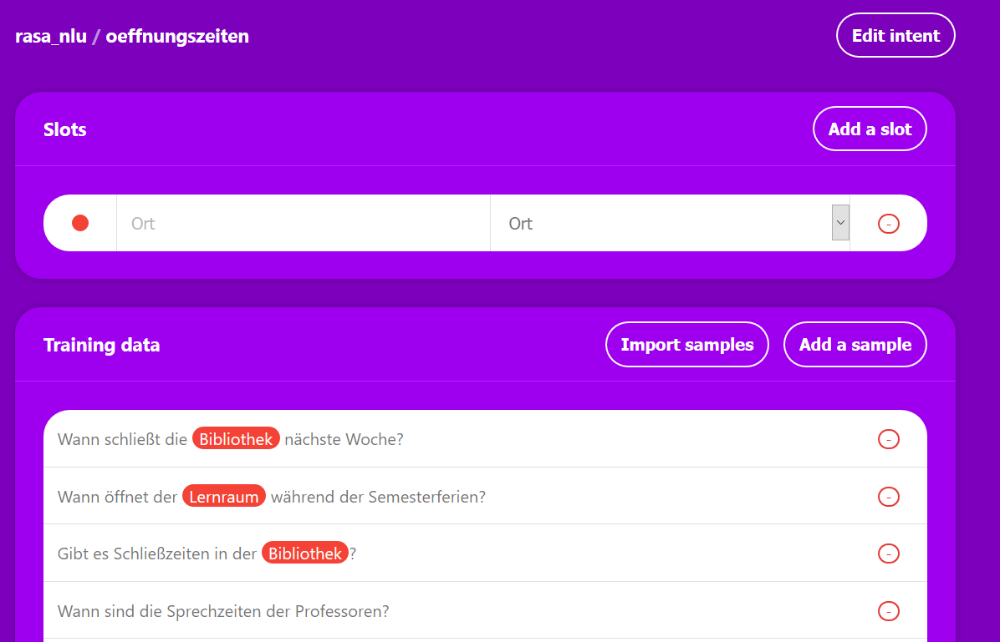

# Rasa NLU


> RASA NLU processor to capture entities from text-messages and determine user-intentions.

## Contents

- [Introduction](#Introduction)
- [Getting Started](#Getting-Started)
- [Usage REST API](#Usage-REST-API)
- [Overview](#Overview)
  - [Project Structure](#Project-Structure)
  - [Functionality](#Functionality)
- [New Training Data](#New-Training-Data)
  - [Create model with local RASA installation](#Create-model-with-local-RASA-installation)
  - [Create model with Docker](#Create-model-with-Docker)
  - [Training Data Format](#Training-Data-Format)
- [References / Further Readings](#References-Further-Readings)
- [Authors](#Authors)

## Introduction

Rasa is an open source solution for developing "AI assistants" or chatbots. Rasa provides a stack consisting of the modules "Rasa NLU" and "Rasa Core". With the help of "Rasa NLU" the user intention is determined from the received text message (Intent Recognition) and afterwards the NLU returns all intentions of the message sorted according to the "Confidence Score". Training data is required to record the user's intentions. Furthermore, Rasa NLU allows "Entity Recognition" to extract relevant terms from the text. The Rasa Core is a dialog engine that uses machine-learning trained models to decide which response to send to the user, such as greet the user. Furthermore, the Core allows "Session Management" as well as "Context-Handling". Within the project only the component "Rasa NLU" will be used, because only the functionality is needed to capture entities from a text message and to determine the user intention.

As part of the chatbot-project, microservices are supposed to run in Docker-Containers. In order to start several different services in containers at the same time, a Docker-Compose-File should be created. A Docker-Image is used for the Rasa NLU. Duckling has also been added as an Docker-Image for capturing date entries and allows to parse dates in a structured text.

Rasa NLU allows the processing of natural language to classify user intentions and extract entities from text.

## Getting Started

The following instructions help you to install RASA for the BeuthBot.

### 0. Requirements

#### Development & Release

- `Docker` version 19.03.8
- `docker-compose `version 1.25.0

Lower versions of `Docker` and `docker-compose `may work but are not tested.

#### Create Training Data

- `Docker` version 19.03.8
- `docker-compose `version 1.25.0

### 1. Clone Repository

```shell
# clone project
$ git clone https://github.com/beuthbot/rasa.git

# change into project directory
$ cd rasa
```

### 2. Run with `docker-compose`

```bash
# build and start containers defined in the `docker-compose.yml`
$ docker-compose up -d
```

Click [here](docker-compose.yml) to see the contents of the `docker-compose.yml` file.

#### 2.1. Portmapping

| Service | Internal Port | External Port |
| ------- | ------------- | ------------- |
| [rasa](https://hub.docker.com/r/rasa/rasa) | 500**5** | 500**5** |
| [duckling](https://hub.docker.com/r/rasa/duckling) | 8000 | - |

See also [here](https://github.com/beuthbot/beuthbot#default-ports-of-services) for a table displaying the default ports and portmapping of the components of the [BeuthBot](https://github.com/beuthbot).

### 3. Confirm the service is running

```shell
# check rasa service running
$ curl http://localhost:5005          # prints "Hello from Rasa: 1.6.0"
```

## Usage REST API

```http
POST   http://localhost:5005/model/parse
```

#### Request Schema - `Message`

```json
{
  "text": "Wie wird das Wetter morgen?",
  "min_confidence_score": 0.8,
  "processors": ["rasa"]
}
```

Whereas the specification of the `min_confidence_score` and the`processors` is optional. If not minimum confidence score is given a default one is used (by now this is `0.8`). For now there is only the usage of RASA implemented so there is no effect of specifying the `processors` property.

#### Response Schema - `Answer`

The response for a successfully processed request to the deconcentrator contains the following information.

```json
{
  "intent": {
    "name": "wetter",
    "confidence": 0.9518181086
  },
  "entities": [
    {
      "start": 20,
      "end": 26,
      "text": "morgen",
      "value": "2020-01-20T00:00:00.000+01:00",
      "confidence": 1.0,
      "additional_info": {
          "values": [
              {
                  "value": "2020-01-20T00:00:00.000+01:00",
                  "grain": "day",
                  "type": "value"
              }
          ],
          "value": "2020-01-20T00:00:00.000+01:00",
          "grain": "day",
          "type": "value"
      },
      "entity": "time",
      "extractor": "DucklingHTTPExtractor"
    }
  ],
  "intent_ranking": [
    {
    	"name": "wetter",
      "confidence": 0.9518181086
    },
    {
      "name": "oeffnungszeiten",
      "confidence": 0.036207471
    },
    {
      "name": "mensa",
      "confidence": 0.0119743915
    }
  ],
  "text": "Wie wird das Wetter morgen?"
}
```


## HTTP-API

Rasa offers several REST APIs to provide server information, training models, etc. The Rasa  features used in the project are listed here:

- **Serverinformation**: You can query the Rasa-server whether it is still running or which Rasa version is available. You can also check which model Rasa is currently using.
- **Model**: You can send requests via the Rest API of the Rasa server to create a trained model or load the model into Rasa. You can also send text to the server and Rasa will then determine the user's intention and the confidence score.

Links:

- [HTTP-API](https://rasa.com/docs/rasa/api/http-api/) (Retrieved 12.12.2019)
- [OpenAPI-specification](https://rasa.com/docs/rasa/_static/spec/rasa.yml) (Retrieved 12.12.2019)

## Overview

> TBD

### Project structure

| **Files** | **About** |
| :------- | ----- |
| `.documentation/` | Contains file for documentation |
| `docker-compose.yml` | Defines the rasa service and duckling service |
| `README.md` | The document you are currently reading |
| `Makefile` | Defines convenient run / training commands |
| `app-models` | Symlink to `app/model/` |
| `training-data` | Symlink to `training/app/data` |
| | |
| **Directories** | **About** |
| `app/` | Volume mounted by the RASA Docker container. |
| `app/model/` | Contains the machine learning trained model (`.tar.gz`) |
| `tests/` | Contains tests |
| `training/` | Contains files realted to training |
| `training/docker-compose.yml` | Contains files realted to training |
| `training/app/` | Contains RASA app files |
| `training/app/config.yml` | Configuration for RASA |
| `training/app/credentials.yml` | Credentials associated with RASA |
| `training/app/domain.yml` | ... |
| `training/app/endpoints.yml` | ... |
| `training/app/data/` | Contains basis data to train RASA.  This is the place for new learning data, e.g. when you are adding a new microservice |
| `training/app/model/` | Contains the model which is created by RASA (`.tar.gz`) |


### Functionality

> TBD

## New Training Data

Training data is needed so that Rasa can identify the intention of a text. Training data can be created in the form of Markdown or JSON. You can define this data in a single file or in multiple files in a directory. 

To create a trained model for Rasa from the Markdown or JSON, Rasa offers a REST API. An alternative to creating trained models is to install Rasa on your local machine and then create the model using the command "rasa train nlu". Rasa creates the training model (tar.gz) from the Markdown or JSON.

There are two ways of generating models from training data. Either with a local RASA installation or with withing a Docker container.

### Create model with local RASA installation

#### Basic requirements
The following installations must be made:
 - `pip`
 - `python` (Version 3.6.8)
 - `tensorflow`
 - Making further installations (https://rasa.com/docs/rasa/user-guide/installation/)
 - __If necessary, further installation via pip (depending on the message of the compiler) __

#### Train model

```bash
# create training model
$ rasa train nlu
```

```bash
# communicating with local RASA NLU on the command line
$ rasa shell nlu –m models/name-of-the-model.tar.gz
```

### Create model with Docker

```bash
# build and run the training docker container
$ docker-compose -f docker-compose.training.yml up --build
```

### Step-by-Step Guide

#### 1. 

#### 2. 

#### 3. 

For further development, it is important that the existing training data be expanded and improved.

- 
- config.yaml: <br>
  contains the configuration of the NLU e.g. specification of the pipeline (how the trained model is generated)
- /data (directory): <br>
  contains training data in the form of JSON (Markdown would also be possible)
- /models: <br>
  contains the trained model in the form of tar.gz.files The model is needed to capture entities and the user intent of a message.


Furthermore Rasa NLU is configurable and is defined by pipelines. These pipelines define how the models are generated with the training data and which entities are extracted. For this, a preconfigured pipeline with "supervised_embeddings" is used. "supervised_embeddings" allows to tokenize any languages.

### Training Data Format


### [Tracy](https://github.com/YuukanOO/tracy)

> Tracy helps you creating training data. This data can be used by RASA to create the model.

In this project we write training data in the form of JSON, because Markdown does not offer the possibility to extract entities from a text message. For this purpose the data was generated with the tool "Tracy" (Link: https://github.com/YuukanOO/tracy ). In the image below, Tracy is shown with "Öffnungszeiten". Entities are added as "slots", such as "Ort". Training data follows in the lower part of the picture. As training data, you can specify messages, which the user can send to the "chatbot". Currently the three user intentions "Mensa", "Wetter" and "Öffnungszeiten" are supported.



> Problem: The training data can be exported as JSON, but the entered values on the "Tracy" application cannot be exported.

## References / Further Readings

- https://rasa.com/ (Retrieved 12.12.2019)
- https://botfriends.de/botwiki/rasa (Retrieved 12.12.2019)
- https://www.artificial-solutions.com/wp-content/uploads/chatbots-ebook-deutsche.pdf (Retrieved 12.12.2019) 
- https://docs.docker.com/ (Retrieved 12.12.2019)
- [Docker-Compose](https://docs.docker.com/compose/) (Retrieved 12.12.2019)
- [Docker Hub Rasa](https://hub.docker.com/r/rasa/rasa) (Retrieved 12.12.2019)
- [Rasa Documentation](https://rasa.com/docs/rasa/) (Retrieved 12.12.2019)
- [Running Rasa with Docker](https://rasa.com/docs/rasa/user-guide/running-rasa-with-docker/) (Retrieved 12.12.2019)

## Authors

- **Abirathan Yogarajah**
- **Lukas Danckwerth** - [GitHub](https://github.com/lukasdanckwerth)

